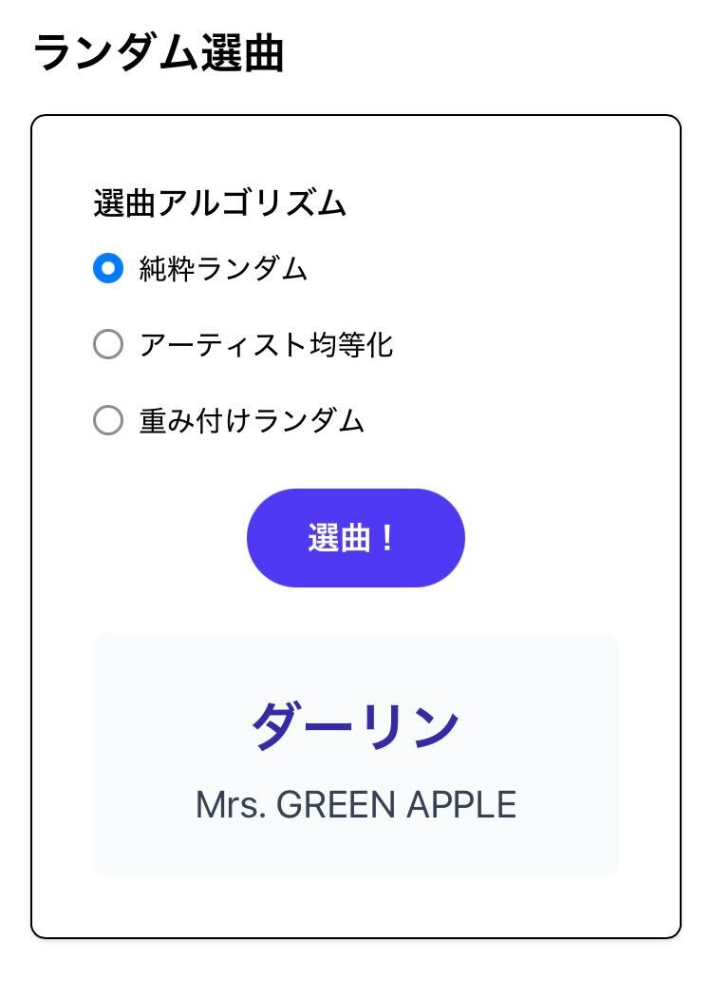
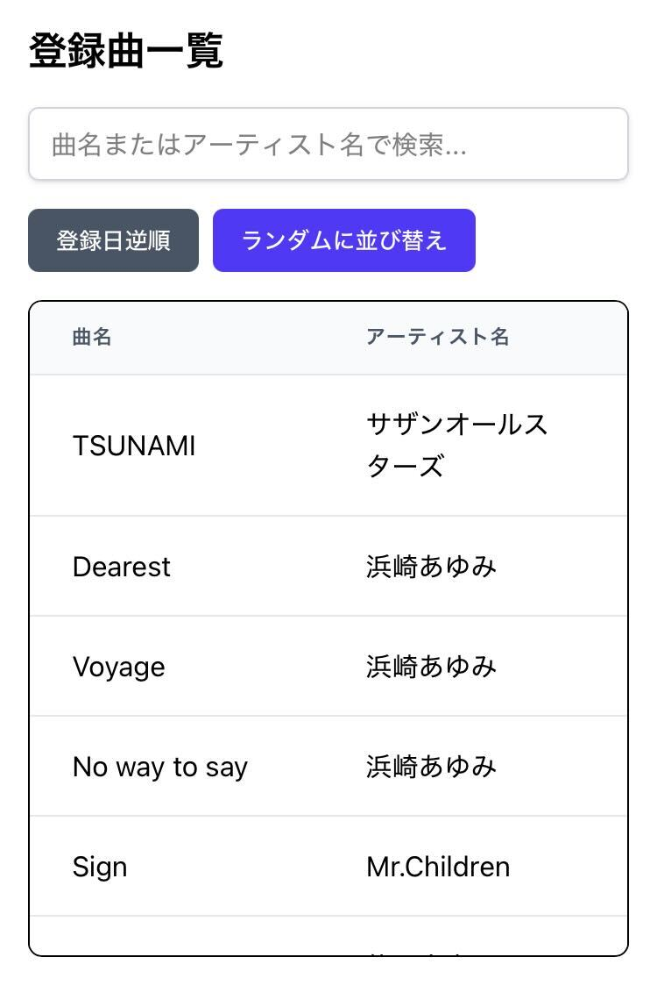
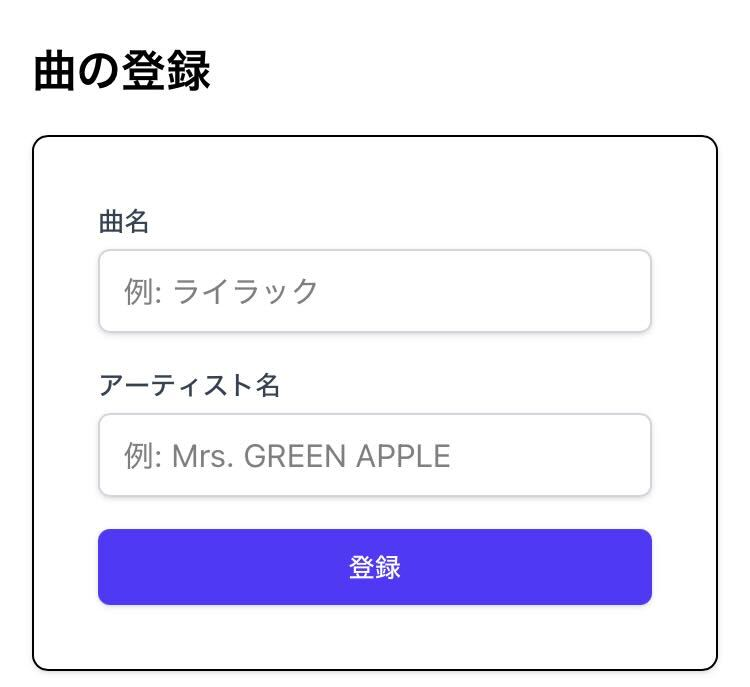

# カラオケランダム選曲アプリ (random-song-picker)

カラオケで歌う曲に迷った際に、事前に登録した持ち歌の中からランダムに曲を提案してくれるWebアプリケーションです。

## 主な機能

- **ランダム選曲**: 登録した曲の中から、3つの異なるアルゴリズムでランダムに曲を選び出します。
- **曲の登録**: 曲名とアーティスト名を入力して、持ち歌リストに新しい曲を追加できます。入力補完機能により、重複登録や表記揺れを防ぎます。
- **一覧と検索**: 登録した曲を一覧で確認できます。曲名やアーティスト名での絞り込み検索や、曲の削除も可能です。

## 使用技術

- **フレームワーク**: [Next.js](https://nextjs.org/)
- **言語**: [TypeScript](https://www.typescriptlang.org/)
- **UI**: [React](https://reactjs.org/), [Tailwind CSS](https://tailwindcss.com/)
- **リンター**: [ESLint](https://eslint.org/)

## セットアップと実行方法

### 1. Docker を使う方法 (推奨)

**前提条件:**
- Docker
- Docker Compose

**手順:**
1.  **コンテナイメージのビルド:**
    ```bash
    docker compose build
    ```
2.  **コンテナの起動:**
    ```bash
    docker compose up -d
    ```
    デフォルトでは `http://localhost:3000` でアプリケーションが起動します。

    ポート番号を変更したい場合は、環境変数 `PORT` を指定してください。
    ```bash
    PORT=3001 docker compose up -d
    ```

3.  **コンテナの停止:**
    ```bash
    docker compose down
    ```

### 2. ホストOSで直接実行する方法

**前提条件:**
- Node.js (v20以上)
- yarn

**手順:**
1.  **依存パッケージのインストール:**
    ```bash
    yarn install
    ```
2.  **開発サーバーの起動:**
    ```bash
    yarn dev
    ```
    `http://localhost:3000` でアプリケーションが起動します。

## 使い方

### ランダム選曲



トップページの「ランダム選曲」セクションで、お好みの選曲方法を選んで「選曲！」ボタンをクリックすると、下に結果が表示されます。

選曲アルゴリズムは以下の3種類です。
1.  **純粋ランダム**: 全ての曲の中から完全にランダムで1曲を選択します。
2.  **アーティスト均等化**: まずアーティストをランダムに1組選び、そのアーティストの曲の中からランダムで1曲を選択します。持ち歌が少ないアーティストの曲も選ばれやすくなります。
3.  **重み付けランダム**: 各アーティストの持ち歌数の平方根を重みとしてアーティストを決定し、その曲の中から1曲を選択します。「純粋ランダム」と「アーティスト均等化」の中間的な方式です。

### 登録曲の一覧表示と検索



「登録曲一覧」セクションで、登録されている全ての曲を確認できます。
-   **検索**: 上部の検索ボックスに曲名やアーティスト名を入力すると、リアルタイムで一覧が絞り込まれます。
-   **並び替え**: 「登録日順」「ランダムに並び替え」ボタンで、リストの表示順を変更できます。
-   **削除**: 削除したい曲をクリックして選択状態にし、「選択した曲を削除」ボタンを押すと、確認ダイアログの後に曲が削除されます。

### 曲の登録



一番下の「曲の登録」セクションで、新しい曲をリストに追加します。
-   曲名とアーティスト名を入力し、「登録」ボタンをクリックします。
-   入力中、既存のデータと前方一致する候補がサジェスト表示され、入力を補助します。

## データベースについて

本アプリケーションのデータは、プロジェクトルートの `db/` ディレクトリ内にある以下のJSONファイルに保存されます。

-   `artists.json`: アーティスト情報を格納
-   `songs.json`: 曲情報を格納

初回起動時など、これらのファイルが存在しない場合は、アプリケーションが自動的に空のファイルを生成します。